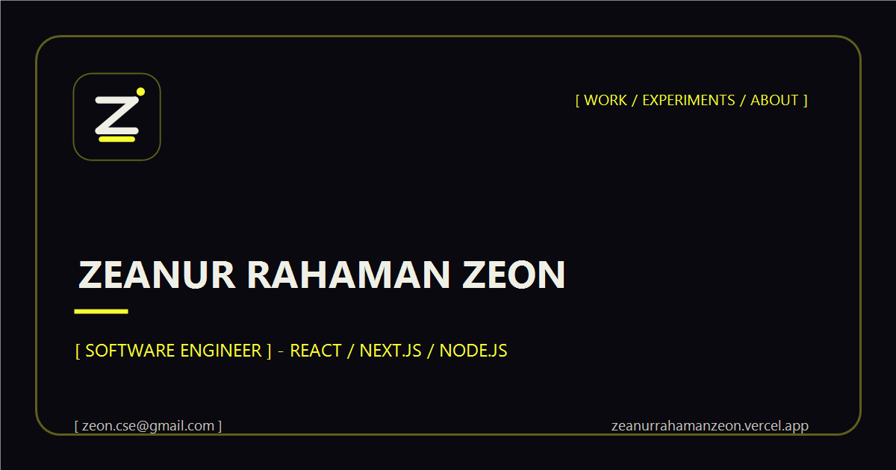

# Zeanur Rahaman Zeon — Portfolio & Lab

> The official source code of **[zeanurrahamanzeon.vercel.app](https://zeanurrahamanzeon.vercel.app)** — the personal portfolio of **Zeanur Rahaman Zeon (md-zeon)**, a full-stack software engineer from Bangladesh.



This is a deeply crafted personal website with a heavy laboratory-technical visual identity: motion-heavy sections, scroll-driven storytelling, case studies, and an experiments "lab". It is built with **Next.js (App Router) + TypeScript + Tailwind CSS**, and **GSAP** (`@gsap/react`) with `ScrollTrigger` and `SplitText` for scroll/motion work.

---

## About

I'm **Zeanur Rahaman Zeon** — a software engineer and final-year CSE student at Northern University Bangladesh who solves real problems end-to-end with clean architecture and solid fundamentals. I don't tie myself to one stack; I start with the problem, pick the right tools, and build shipped products.

This repository powers:

- **The live site** → [zeanurrahamanzeon.vercel.app](https://zeanurrahamanzeon.vercel.app)
- **GitHub** → [md-zeon](https://github.com/md-zeon)
- **LinkedIn** → [zeanur-rahaman-zeon](https://www.linkedin.com/in/zeanur-rahaman-zeon/)
- **Email** → [zeon.cse@gmail.com](mailto:zeon.cse@gmail.com)

---

## Featured Projects & Case Studies

Every project has a full in-depth case study with recorded walkthroughs on the site.

| Project | Stack | Live / Case Study |
| --- | --- | --- |
| **Smart NUB Campus** — real-time campus collaboration network (messaging, study groups, gamified learning, AI assistant) | Next.js 16, Express 5, Prisma, PostgreSQL, Socket.IO, Redis, Gemini, Groq | [Case study](https://zeanurrahamanzeon.vercel.app/work/smart-nub-campus) · 195+ REST endpoints across 48 DB models |
| **DevQnA** — developer Q&A platform (voting, MDX authoring, AI-assisted answers) | Next.js 15, React 19, MongoDB, Mongoose, NextAuth, Vercel AI SDK | [Case study](https://zeanurrahamanzeon.vercel.app/work/devqna) · [Live](https://dev-qna.vercel.app) |
| **Oshudpati Marketplace** — medicine & healthcare marketplace for Bangladesh | Next.js 16 storefront, Express 5 API, PostgreSQL, Prisma, Better-Auth, Cloudinary | [Case study](https://zeanurrahamanzeon.vercel.app/work/oshudpati-marketplace) · [Live](https://oshudpati-marketplace-client.vercel.app) |
| **MicroEarn** — micro-task marketplace with a server-authoritative coin economy and real Stripe payments | React 19 + Vite, Express 5, MongoDB, Firebase Auth, Stripe | [Case study](https://zeanurrahamanzeon.vercel.app/work/microearn) · [Live](https://micro-earn-7be08.web.app) |

Plus a growing **lab** of experiments — Space Shooter, Taskero, HistoTrack, Brick Breaker, Kurosumi, Shortle, QR Generator — browsable at [zeanurrahamanzeon.vercel.app/experiments](https://zeanurrahamanzeon.vercel.app/experiments).

---

## Tech Stack

- **Framework**: Next.js 16 (App Router, Turbopack), React 19
- **Language**: TypeScript
- **Styling**: Tailwind CSS v4
- **Motion**: GSAP (`ScrollTrigger`, `SplitText`), Lenis smooth scroll, Swiper, Lottie
- **Services**: Node.js, nodemailer (contact API), SWR-style data via `src/data`
- **Deployment**: Vercel (with HSTS, sitemap, robots, and `generateStaticParams` static rendering)

---

## Repository Structure

```
src/
├── app/               # Pages: /, /work, /work/[slug], /experiments, /about, /contact, /privacy-policy
│   ├── sitemap.ts     # Generates the XML sitemap from site + case-study data
│   ├── robots.ts      # Robots directives
│   └── api/contact/   # Contact form API route (uses nodemailer)
├── components/        # Layout, sections, media, and shared UI
├── data/              # All copy, project metadata, and slide data (no hardcoded content)
└── lib/               # Routers/hooks: useLabSlider, useHeaderReveal, lenis, sound, gsap
```

See also: `public/` assets, `next.config.ts`, `tailwindcss` (v4, via PostCSS).

---

## SEO & Performance

- JSON-LD structured data (`Person` + `WebSite`) in the root layout
- `rel=me` links, canonical URLs, and Open Graph / Twitter cards on every page
- Auto-generated `sitemap.xml` and `robots.txt`
- Geographic/person meta tags, per-sub-page titles
- Optimized media: re-encoded audio/video, deferred CTA videos, trimmed font preloads, `noscript` fallback, accessible `decorative` videos

---

## Getting Started

```bash
npm install    # install dependencies
npm run dev    # start the development server (http://localhost:3000)
npm run lint   # lint with ESLint
npm run build  # production build (uses Turbopack)
```

> [!NOTE]
> `.env.local` holds the secrets used by the contact API route (git-ignored). Copy `.env.example` and fill in your values.

---

## License & Copyright

Copyright (c) 2026 **Zeanur Rahaman Zeon**. All rights reserved.

This repository is published for **viewing and reference only**. You may not
copy, adapt, or reuse it as a template, base, or starter for your own project,
nor republish or redistribute it in any form, without written permission from
the author. See the [LICENSE](LICENSE) file for full terms. For permission,
contact [zeon.cse@gmail.com](mailto:zeon.cse@gmail.com).